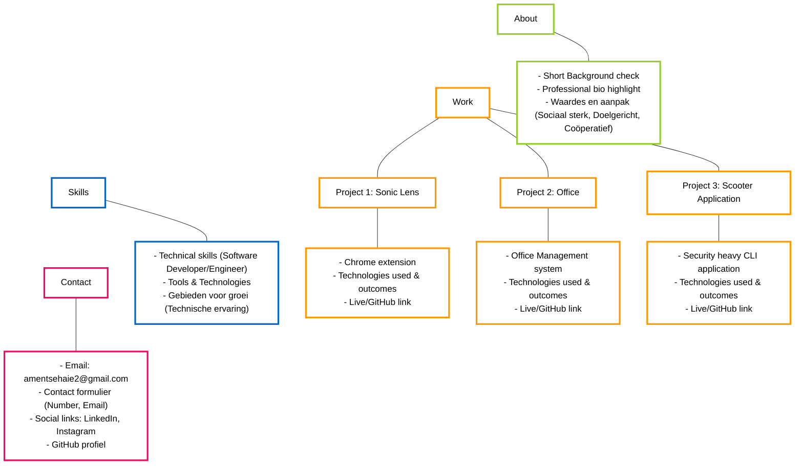

# Portfolio Scenarios & User Flow Diagram

# Portfolio Structuur / Site Map

Hier is het overzicht van de website navigatie en content blokken, gestructureerd op basis van je PRD en visuele model:

### Explanation of Scenarios:
1. **NavEngine (Scroll & Navigation)**: Tracks the user's scroll position to trigger the Header's glassmorphism transition (Transparent to Frosted) and the Fluid Background's parallax effect.
2. **Project Card Interaction**: Handles the micro-interactions when a user hovers over a project (triggering the Mentos-style neon glow) and clicking to view a larger case study or detail modal.
3. **Contact Form Flow**: Maps out the exact validation states (showing errors vs. valid inputs) and the asynchronous submission states (Sending, Success, Error).
